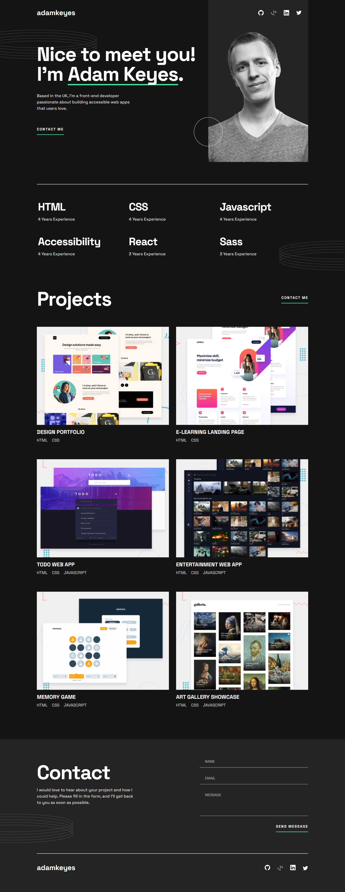

# Frontend Mentor - Single-page developer portfolio solution

This is a solution to the [Single-page developer portfolio challenge on Frontend Mentor](https://www.frontendmentor.io/challenges/singlepage-developer-portfolio-bBVj2ZPi-x). Frontend Mentor challenges help you improve your coding skills by building realistic projects. 

## Table of contents

- [Overview](#overview)
  - [The challenge](#the-challenge)
  - [Screenshot](#screenshot)
  - [Links](#links)
- [My process](#my-process)
  - [Built with](#built-with)
- [Author](#author)

## Overview

### The challenge

Users should be able to:

- Receive an error message when the `form` is submitted if:
  - Any field is empty
  - The email address is not formatted correctly
- View the optimal layout for the interface depending on their device's screen size
- See hover and focus states for all interactive elements on the page
- **Bonus**: Hook the form up so it sends and stores the user's enquiry (you can use a spreadsheet or Airtable to save the enquiries)
- **Bonus**: Add your own details (image, skills, projects) to replace the ones in the design

### Screenshot

### Links

- Solution URL: [https://github.com/Praise25/Developer-portfolio](https://github.com/Praise25/Developer-portfolio)
- Live Site URL: [https://developer-portfolio-version-one.vercel.app/](https://developer-portfolio-version-one.vercel.app/)

## My process

### Built with

- React
- Typescript

## Author

- Frontend Mentor - [@Praise25](https://www.frontendmentor.io/profile/Praise25)
- Twitter - [@PraiseTheDev](https://x.com/PraiseTheDev)
- LinkedIn - [Anene Praise](https://www.linkedin.com/in/praise-anene-07776416a/)